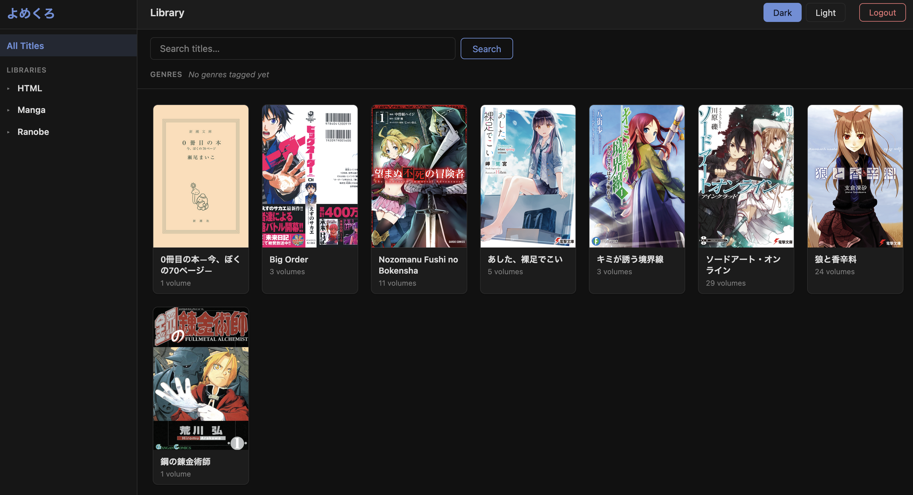
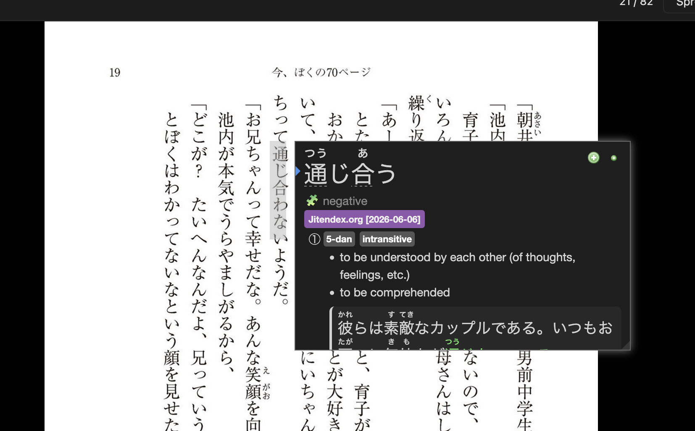
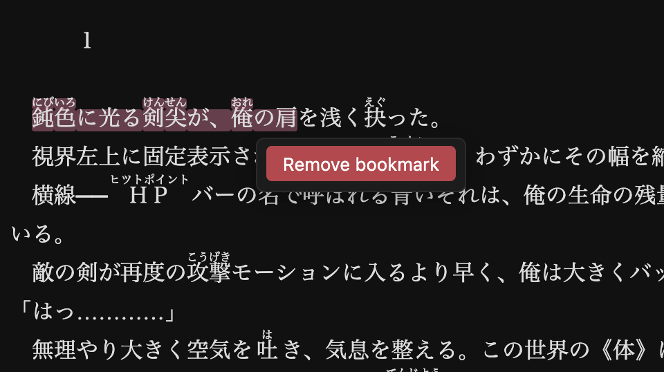
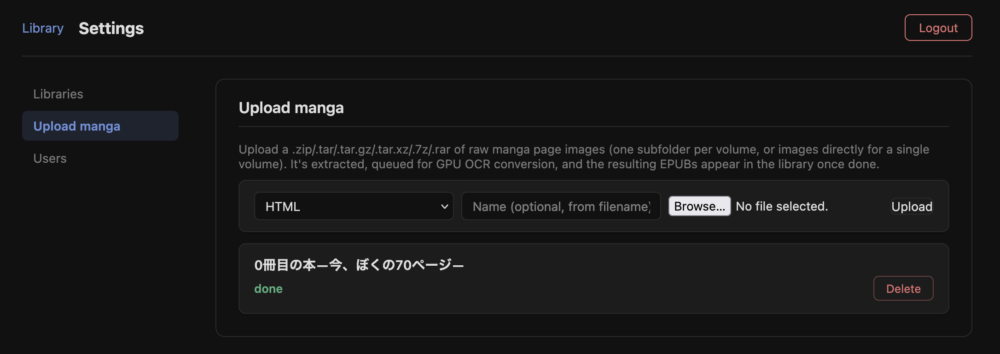
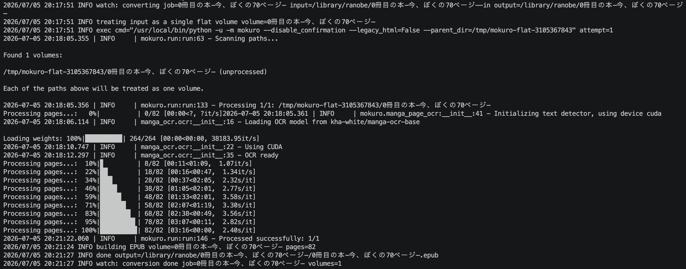

# yomekuro

[English](README.md)

Самостоятельно размещаемая (self-hosted) EPUB-библиотека для японских ранобэ и манги. Один бинарник + PostgreSQL. Никакого OAuth, никаких внешних источников метаданных — всё берётся напрямую из EPUB-файлов.

Включает в себя отдельный **конвертер**, превращающий папки с картинками манги в EPUB с фиксированной вёрсткой и OCR-слоем текста для [Yomitan](https://github.com/themoeway/yomitan).

**Живое демо:** https://yomekuro.kubehomelab.space — логин `test` / `test`, чтобы просто посмотреть.

---

## Быстрый старт

```bash
cp .env.example .env
# отредактируйте .env — задайте POSTGRES_PASSWORD и YOMEKURO_ADMIN_PASSWORD

docker compose up -d --build
```

`docker-compose.yml` — это симлинк на `docker-compose.dev.yml`: он собирает
все образы из исходников (yomekuro + сервисы конвертера) прямо на вашей
машине. Для продакшн-хоста, на котором не нужен Go/Python-тулчейн и просто
запускается уже выпущенная версия, используйте вместо этого
`docker-compose.prod.yml` — он тянет готовые образы с Docker Hub:

```bash
cp .env.example .env
# отредактируйте .env — задайте POSTGRES_PASSWORD, YOMEKURO_ADMIN_PASSWORD
# и два тега образов для скачивания: YOMEKURO_VERSION и CONVERTER_VERSION

docker compose -f docker-compose.prod.yml pull
docker compose -f docker-compose.prod.yml up -d
```

`yomekuro` и `converter` версионируются и публикуются независимо друг от
друга (`YOMEKURO_VERSION` выбирает `truebad0ur/yomekuro:<tag>`,
`CONVERTER_VERSION` — `truebad0ur/converter:gpu-<tag>`) — можно поднять
версию одного без пересборки/скачивания другого, если менялась только одна
сторона. См. раздел "Релизы" ниже о том, как версии публикуются на Docker
Hub.

Монтируется один каталог `./library` с двумя подпапками внутри: `manga/` и
`books/` (одна папка на серию/книгу, внутри `.epub` файлы; `books/` также
хранит отдельные `.html` файлы прямо внутри себя, один файл = одна книга).
Обе регистрируются как отдельные библиотеки и сканируются автоматически при
старте. Откройте http://localhost:8080 и войдите.

Dev-компоуз также поднимает сервисы конвертера (`converter`,
`converter-gpu`, `converter-worker` — см. "Конвертер" ниже) через `include:`
в `docker-compose.dev.yml`. `converter/docker-compose.yml` по-прежнему
работает отдельно, если нужен только конвертер без yomekuro.

---

## Использование yomekuro

### Главная страница библиотеки

Главная страница показывает ваши серии в виде плиток с обложками. Строка
вкладок по центру над сеткой переключает между «All Titles» и каждой
библиотекой (Books / Manga); клик по серии показывает её книги, клик по книге
открывает чтение. Поиск и фильтры по жанрам/тегам — в шапке.

У каждой книги есть меню **⋯** (справа сверху на обложке), где можно **отметить
том прочитанным или непрочитанным** — удобно, когда книга дочитана не на самой
последней странице. Прочитанные тома показывают «Read» вместо процента, в
остальных случаях полоска отражает прогресс чтения. Администраторам в том же
меню доступен пункт «Edit genres».



### Чтение

Манга открывается в режиме постраничного просмотра с фиксированной вёрсткой
(с переключателем **Spread** для разворотов на два листа); ранобэ
открываются в прокручиваемом или вертикальном (RTL) режиме. Yomitan работает
напрямую с OCR-текстом поверх страниц манги — без iframe. Клавиатурные
сочетания — см. раздел [Читалка](#читалка) ниже.

На телефоне листайте страницы манги свайпом или тапом по левому/правому краю
экрана — выделение текста (для закладки) срабатывает только на настоящее
долгое нажатие, поэтому обычный тап или свайп никогда не оставляет случайную
подсветку. Страница, снятая как один готовый разворот из двух физических
страниц (а не по фото на страницу), по умолчанию показывается по половине за
раз — нажмите **Spread**, чтобы увидеть исходную картинку целиком.



### Закладки

Выделите текст во время чтения, чтобы отметить его закладкой (подсветкой);
выделения сохраняются отдельно для каждой книги и не ломаются на страницах
с фуриганой (`<ruby>`/`<rt>`), так как в тег оборачиваются только отдельные
текстовые узлы, а не целые элементы.



### Настройки (только для администраторов)

У обычных пользователей в шапке есть только переключатель темы и кнопка
выхода. У администраторов дополнительно есть страница настроек — управление
библиотеками, пользователями и загрузка манги на OCR-конвертацию.



### Загрузка и очередь (только для администраторов)

Настройки → Upload & Jobs: выберите библиотеку, перетащите в область загрузки
архивы с исходными изображениями страниц, PDF и/или отдельные `.html`-файлы,
и укажите имя. **Можно выбрать сразу несколько файлов** — каждый
архив/PDF станет отдельной задачей конвертации и встанет в очередь;
`.html`-файлу конвертация вообще не нужна — он просто копируется в
библиотеку и появляется за секунды.

Галочка **«Add to an existing book»** добавляет тома в книгу, которая уже есть в
библиотеке, вместо создания новой. Несколько томов можно поставить в очередь к
одной книге одновременно — в том числе пока идёт её исходная конвертация.

Задачи показываются тут же, с текущим томом, и их можно остановить (а
завершённые — убрать из списка).



### Управление книгами (только для администраторов)

Настройки → Manage Books показывает все книги, уже имеющиеся в библиотеках,
по томам:

- **Reconvert (full OCR)** — полностью перезапускает OCR с нуля (не
  пересборку из кэша) для одного тома или всей книги, чтобы подхватить
  любое улучшение качества конвертера/mokuro. Доступно, только пока на
  диске ещё есть исходный скан книги (`<name>-in/`) — иначе показывается
  «no raw scan».
- **Download** — забирает том обратно в виде архива страниц-**картинок**
  (`.zip`), **PDF** или исходного **EPUB**, прямо из уже собранного файла —
  исходный скан для этого не нужен. Удобно, чтобы протестировать загрузку
  заново, не пересобирая исходный скан. У ранобэ/обычного EPUB (без
  картинок страниц вообще) доступно только скачивание EPUB; у отдельной
  HTML-книги — скачивание HTML.
- **Delete** — безвозвратно удаляет книгу: и её EPUB(ы), и папку с исходным
  сканом, если есть. Перед этим — подтверждение в диалоге браузера,
  заблокировано, пока по этой книге в очереди/выполняется конвертация.
  Отменить нельзя. Отдельный том тоже можно удалить самостоятельно, не
  трогая остальные тома книги и общую папку исходного скана.

---

## .env

```dotenv
POSTGRES_USER=yomekuro
POSTGRES_PASSWORD=change-me        # openssl rand -base64 24
POSTGRES_DB=yomekuro
YOMEKURO_ADMIN_USER=admin
YOMEKURO_ADMIN_PASSWORD=change-me
```

Полный список — в `.env.example`, включая опциональные настройки
(`YOMEKURO_JOBS_POLL_INTERVAL_MS`, `YOMEKURO_ZIP_CACHE_SIZE`,
`CONVERTER_POLL_INTERVAL`, `CONVERTER_PROGRESS_EVERY`,
`CONVERTER_MOKURO_RETRIES`, `CONVERTER_MOKURO_RETRY_DELAY`) — у всех есть
разумные значения по умолчанию, если не заданы.

---

## Сборка

```bash
# yomekuro
docker build -t yomekuro:latest .

# converter — только CPU (~2.5ГБ)
docker build -f converter/Dockerfile.cpu -t converter:cpuonly converter/

# converter — AMD ROCm GPU (только amd64, см. раздел "Конвертер")
docker build -f converter/Dockerfile.gpu -t converter:gpu converter/

# Go-бинарник напрямую
CGO_ENABLED=0 go build -o yomekuro ./cmd/yomekuro
```

### Мульти-архитектурная сборка (amd64 + arm64), пуш в реестр

```bash
docker buildx create --name multi --driver docker-container --use   # один раз

docker buildx build --platform linux/amd64,linux/arm64 \
  -t truebad0ur/yomekuro:<tag> --push .

docker buildx build --platform linux/amd64,linux/arm64 \
  -f converter/Dockerfile.cpu -t truebad0ur/converter:cpuonly --push converter/
```

`Dockerfile.gpu` собирается только под amd64 и завязан на проброс GPU
хоста — собирайте и запускайте его локально через `docker compose`, не
пушьте мульти-архитектурно.

### Релизы (CI)

`.github/workflows/release.yml` автоматически собирает и пушит все три
образа на Docker Hub — но только когда появляется тег, и только если этот
тег указывает на коммит в `main`. Обычные коммиты, ветки и pull request'ы
(в том числе из форков) сборку никогда не запускают. Работает любой из
двух способов:

```bash
# обычный git tag + push
git checkout main
git tag <tag>
git push origin <tag>
```

либо создать Release на GitHub (Releases → "Draft a new release" → указать
новый тег → Publish). Оба способа запускают workflow — тег, запушенный из
CLI, это событие `push`, тег, созданный через интерфейс Releases — событие
`release`, и workflow слушает оба.

В любом случае будет запушено:

- `truebad0ur/yomekuro:<tag>` (linux/amd64 + linux/arm64)
- `truebad0ur/converter:cpu-<tag>` (linux/amd64)
- `truebad0ur/converter:gpu-<tag>` (linux/amd64)

Само имя тега становится тегом образа как есть — никакого принудительного
префикса `v`. Сборки используют кэш слоёв GitHub Actions
(`cache-from`/`cache-to: type=gha`), отдельный для каждого образа, поэтому
повторный запуск workflow (например, после случайного сбоя) не пересобирает
неизменившиеся слои. Перед сборкой любого образа джоба `test` заново
запускает `test.yml` (gofmt/vet/build/test/golangci-lint для обоих
модулей) — если коммит под тегом его не проходит, публикации не будет.

**Частые команды для релизов:**

```bash
# новый коммит, пуш и тег одной командой
git add -A && git commit -m "msg" && git push origin main && git tag <tag> && git push origin <tag>

# затегать то, что уже есть в main (без нового коммита)
git fetch origin main && git tag <tag> origin/main && git push origin <tag>

# amend текущего коммита, force-push main, перенос существующего тега на него
git add . && git commit --amend --no-edit && git push origin main -f && git tag -f <tag> && git push origin <tag> -f
```

`git tag <name>` создаёт легковесный (lightweight) тег — `git push origin
<name>` (по имени) всегда его пушит, а вот `git push --follow-tags`
молча пропускает легковесные теги (следует только за аннотированными,
`git tag -a`), поэтому теги нужно пушить явно по имени.

**Обновление только одного образа вручную:** описанный выше CI-флоу всегда
публикует все три образа под одним общим тегом, что правильно для
скоординированного релиза. Если менялся только `yomekuro` (или только
`converter`), необязательно принудительно поднимать версию и на другой
стороне — соберите и запушьте нужный образ вручную под своим новым тегом,
затем поменяйте в `.env` только соответствующую переменную
(`YOMEKURO_VERSION` или `CONVERTER_VERSION`):

```bash
docker build -t truebad0ur/yomekuro:<tag> .
docker push truebad0ur/yomekuro:<tag>
# .env: YOMEKURO_VERSION=<tag> (CONVERTER_VERSION остаётся как был)
```

**Необходимые секреты** в GitHub Environment `prod` (Settings → Environments
→ `prod` → Environment secrets — не секреты уровня репозитория; джобы сборки
явно указывают `environment: prod`, чтобы их получить. Форкам не нужны,
так как форки их не наследуют, а workflow вообще отказывается запускаться
за пределами этого репозитория):

- `DOCKERHUB_USERNAME` — ваш логин на Docker Hub (`truebad0ur`).
- `DOCKERHUB_TOKEN` — **access-токен** Docker Hub, а не пароль от
  аккаунта: Docker Hub → Account Settings → Security → New Access Token,
  scope "Read & Write". Вставьте значение токена в качестве секрета.

---

## Конвертер (манга-OCR → EPUB)

Использует [mokuro](https://github.com/kha-white/mokuro) для распознавания
японского текста. `converter/docker-compose.yml` определяет три сервиса:
`converter` (CPU, одноразовый CLI), `converter-gpu` (AMD ROCm, одноразовый
CLI) и `converter-worker` (AMD ROCm, постоянно работающий — разбирает
очередь загрузок, см. ниже).

### Загрузка через UI (рекомендуется)

Settings → Upload & Jobs: выберите библиотеку, файл и имя. Файл — либо архив
(`.zip`/`.tar`/`.tar.gz`/`.tar.xz`/`.7z`/`.rar`) с исходными изображениями
страниц, либо `.pdf`. yomekuro стейджит его в `<library>/<name>-in/`
(архивы по пути распаковываются, системный мусор — `.DS_Store`,
`__MACOSX/`, `._*` — убирается) и ставит строку в очередь в Postgres
(таблица `conversion_jobs`). `converter-worker` забирает её и для каждого
тома:

(Отдельный `.html`-файл минует всё это — без OCR, без очереди, просто
копируется прямо в библиотеку.)

- **Картинки страниц / скан-PDF** (без текстового слоя): прогоняет OCR
  через mokuro на GPU.
- **PDF с реальным текстовым слоем**: OCR вообще пропускается — текст и его
  точные координаты берутся прямо из PDF (`pdftotext -bbox-layout`) и
  накладываются поверх отрендеренных страниц — та же fixed-layout структура,
  что и у тома после OCR. Есть ли у PDF текстовый слой, определяется
  автоматически (по среднему числу непробельных символов на страницу выше
  порога).

В любом случае результат — EPUB в `<library>/<name>/`, их подхватит
следующее сканирование библиотеки автоматически. Статус задачи опрашивается
на той же странице настроек.

Для этого нужен `./library`, смонтированный на чтение-запись (по умолчанию
так и есть) — стейджинг пишет прямо в него.

### Папки вручную

Подкладывание заранее подготовленной папки `<name>-in/` в библиотеку вручную
(без загрузки через UI) тоже работает — `converter-worker` опрашивает и их,
конвертируя так же, пропуская уже полностью сконвертированные. Полезно для
контента, подготовленного каким-то другим способом или перенесённого
откуда-то ещё.

### CLI (ручные одноразовые запуски)

Для разовых запусков вне общего флоу загрузки.

#### Структура входных данных

Одна подпапка на том (каждая станет своим EPUB):

```
library/manga/test-in/
  Dungeon Meshi v01/
    001.jpg
    002.jpg
  Dungeon Meshi v02/
    ...
```

Либо укажите `--input` прямо на папку с изображениями без подпапок — она
будет обработана как один том/EPUB, названный по имени папки:

```
library/manga/One-Shot Story-in/
  001.jpg
  002.jpg
```

#### Запуск

```bash
# все тома (CPU)
docker compose -f converter/docker-compose.yml run --rm converter \
  --input /library/manga/test-in --output /library/manga/test

# то же самое, на GPU
docker compose -f converter/docker-compose.yml run --rm converter-gpu \
  --input /library/manga/test-in --output /library/manga/test

# один том, принудительный перезапуск
docker compose -f converter/docker-compose.yml run --rm converter \
  --input /library/manga/test-in --output /library/manga/test \
  --volume "Dungeon Meshi v01" --no-cache
```

Веса модели скачиваются при первом запуске и кэшируются в `converter/data/`.

### Качество OCR против скорости

Детектор текста работает с удвоенным (относительно значения по умолчанию у
mokuro) разрешением — это примерно в 2-3 раза дольше на страницу, зато
заметно меньше ошибок распознавания: мелкий маркер нумерованного списка или
плотный текст в колонтитуле гораздо реже сливается с соседней строкой при
OCR. Действует для всех будущих конвертаций; уже сконвертированные книги не
затрагиваются, пока их не переконвертируют заново (Settings → Manage Books →
Reconvert).

### AMD GPU (ROCm)

ROCm-сборка PyTorch несёт свои собственные библиотеки рантайма — никакие
apt-пакеты ROCm в образе не нужны, нужен только хост с драйвером ядра
`amdgpu` и `/dev/kfd`/`/dev/dri`. `converter-gpu` уже пробрасывает их, плюс
`HSA_OVERRIDE_GFX_VERSION=10.3.0` — нужно потому, что большинство GPU RDNA2
не топовых моделей (Navi 21/22/23 — RX 6700/6700S/6650XT/6600 и т.д.)
сообщают ID `gfx103x`, для которого ROCm не поставляет оптимизированные
ядра; переопределение на `10.3.0` (gfx1030, RX 6800/6900, то же поколение)
на практике работает. Не переопределяйте между разными поколениями RDNA.

GID-ы в `group_add` (`44`/`992`) — это группы `video`/`render` конкретно
этого хоста (`getent group video render`) — проверьте, что они совпадают
на своём.

---

## Читалка

- Манга с фиксированной вёрсткой: постранично, поддержка RTL, Yomitan
  работает с OCR-текстом без iframe
- Ранобэ: прокручиваемый или вертикальный (RTL) режим
- Клавиатура: `←` / `→` — предыдущая/следующая страница; `↑` / `↓` —
  прокрутка внутри увеличенной страницы; `Ctrl +` / `Ctrl -` / `Ctrl 0` —
  увеличение/уменьшение/сброс масштаба
- Тачскрин: свайп или тап по левому/правому краю листает страницы манги;
  долгое нажатие выделяет текст для закладки, обычный тап — никогда
- Режим разворота: переключатель **Spread** в панели навигации

### Поиск по словам (Yomitan / 10ten)

На страницах манги и PDF распознанный (или извлечённый из PDF) текст — это
невидимый выделяемый слой, наложенный прямо на печатные символы, поэтому
всплывающие словари — [Yomitan](https://github.com/themoeway/yomitan), 10ten
Japanese Reader — ищут слова по наведению без белого текстового бокса (в
отличие от собственной читалки mokuro, которая показывает распознанный текст
при наведении).

Каждая строка остаётся одним элементом с непрерывным текстом, поэтому словари
по-прежнему собирают из символов многосимвольные слова. Положить этот слой
именно **на** глифы непросто: рамка детектора обводит чернила строки, а не её
знакоместа, наклоняется вместе с печатью и шире самих глифов — всё это
конвертер вымеряет (`ocrSpanSlack` / `lineGeometry` в `converter/epub.go`),
чтобы overlay шёл вместе со страницей, а не сползал с неё. Для PDF с текстовым
слоем всё это не нужно — там берутся собственные координаты PDF.

---

## Библиотеки

`docker-compose.yml` монтирует один том:

```yaml
volumes:
  - ./library:/library
```

Внутри него две подпапки автоматически регистрируются как отдельные
библиотеки и сканируются при старте — вручную ничего добавлять не нужно:

```
library/
  manga/    # EPUB манги (результат конвертера или своя), одна папка на серию
  books/    # всё остальное: ранобэ, PDF, отдельные .html файлы — одна папка
            # на серию/книгу, .html файлы лежат прямо внутри
```

Весь том `./library` монтируется на чтение-запись (не `:ro`), потому что
функция загрузки распаковывает архивы прямо в ту библиотеку, что выберете
(`library/manga/` или `library/books/`).

Заголовки HTML-книг берутся из `<title>`, с опциональными
`<meta name="author" content="...">` и
`<meta name="reading-direction" content="rtl">` в `<head>`. Поскольку у
отдельного HTML-файла нет встроенной обложки, как у EPUB, миниатюра для
главной страницы генерируется автоматически — заголовок и короткий
фрагмент текста на простой карточке.

---

## Лицензия

ISC — см. [LICENSE](LICENSE).
